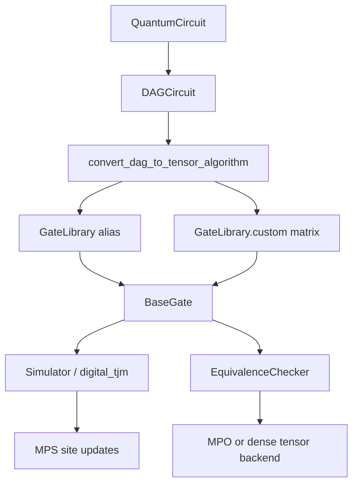

# Custom Gates in YAQS

```{note}
This is a **reference guide** with static code blocks; it is not executed during the documentation build. Runnable circuit examples are in {doc}`strong_simulation` and {doc}`equivalence_checking`.
```

YAQS represents every digital gate as a {class}`~mqt.yaqs.core.libraries.gate_library.BaseGate`
instance from {class}`~mqt.yaqs.core.libraries.gate_library.GateLibrary`. Circuits enter YAQS as
Qiskit {class}`qiskit.circuit.QuantumCircuit` objects; the library converts each DAG operation
into an internal gate, then applies that gate during **circuit simulation** or **equivalence
checking**.

This page explains that pipeline, how built-in and custom gates are translated, and how to
supply an analytic **generator** when you want long-range two-qubit gates to use the TDVP
window path.

## How YAQS handles gates end-to-end



### Internal gate objects

Each {class}`~mqt.yaqs.core.libraries.gate_library.BaseGate` carries:

| Field         | Role                                                                                                                                                                    |
| ------------- | ----------------------------------------------------------------------------------------------------------------------------------------------------------------------- |
| `matrix`      | Dense unitary as a `2^n × 2^n` complex matrix (`n` = number of qubits the gate acts on).                                                                                |
| `tensor`      | Tensor layout used in MPS/MPO contractions (for two-qubit gates: shape `(2, 2, 2, 2)` after `set_sites`).                                                               |
| `interaction` | Number of qubits (`1`, `2`, …); inferred from `matrix` size (`dim = 2**interaction`).                                                                                   |
| `sites`       | MPS site indices the gate acts on, set via `set_sites(...)`.                                                                                                            |
| `generator`   | Optional. For **two-qubit** built-ins that support TDVP: a list of two `2×2` local operators used to build a generator MPO. Not set by plain `GateLibrary.custom(...)`. |
| `name`        | Qiskit operation name or `"custom"`.                                                                                                                                    |

Built-in gates (`cx`, `h`, `rxx`, …) are classes on {class}`~mqt.yaqs.core.libraries.gate_library.GateLibrary`.
`GateLibrary.custom(matrix)` returns a generic {class}`~mqt.yaqs.core.libraries.gate_library.BaseGate`
backed only by the unitary matrix.

### Translation from Qiskit

{func}`~mqt.yaqs.digital.utils.dag_utils.convert_dag_to_tensor_algorithm` walks a
{class}`qiskit.dagcircuit.DAGCircuit` and produces a list of `BaseGate` objects.

For each operation node:

1. **Unsupported instructions** raise `ValueError`: `reset`, `delay`, `store`, mid-circuit
   `measure`, classically controlled ops, and control-flow instructions (`if_else`, `for_loop`, …).
2. **`barrier`** nodes are skipped during conversion (ignored for unitary evolution).
3. **Known Qiskit names** (for example `h`, `cx`, `u3`, `u1`, `swap`, `rxx`) map to hardcoded
   {class}`~mqt.yaqs.core.libraries.gate_library.GateLibrary` classes via `getattr(GateLibrary, name)`.
4. **Any other one- or two-qubit unitary** falls back to the **matrix path**: Qiskit's
   `to_matrix()` / {class}`qiskit.quantum_info.Operator` data is wrapped as
   `GateLibrary.custom(matrix)` with the Qiskit `op.name` preserved.

```{note}
**Three-qubit and larger gates** (including Toffoli / CCX) are not supported by the Qiskit
translation layer. Only one- and two-qubit unitaries are accepted on the matrix fallback path.
```

Symbolic parameters must be bound before translation; unbound {class}`qiskit.circuit.Parameter`
objects raise `ValueError`.

### Application during circuit simulation

{class}`~mqt.yaqs.Simulator` runs digital circuits through {mod}`~mqt.yaqs.digital.digital_tjm`:

- **Single-qubit gates** — contract the gate tensor onto the corresponding MPS site.
- **Two-qubit gates** — routed by `StrongSimParams.gate_mode` / `WeakSimParams.gate_mode`
  (see {doc}`simulation_parameters`):
  - **`mpo`** (default) — TEBD/SVD on nearest-neighbor pairs; long-range gates via extended gate MPO.
  - **`swaps`** — TEBD with SWAP routing for long-range pairs.
  - **`tdvp`** — TEBD on nearest-neighbor pairs; long-range pairs use **2TDVP** only when the gate
    has a `generator`; otherwise the MPO path is used.
  - **`full-tdvp`** — 2TDVP on every two-qubit gate that has a `generator`; generator-less gates
    fall back to TEBD (NN) or MPO (long-range).

**Measurements** are handled differently from unitary conversion:

- During **simulation**, terminal `measure` nodes are removed from the live DAG so evolution can
  proceed; sampling uses the remaining circuit structure.
- During **equivalence checking**, final measurements are stripped from both circuits before
  comparison; mid-circuit measurements raise `ValueError`.

Plain `barrier` instructions are dropped in simulation except barriers labelled
`SAMPLE_OBSERVABLES` (used for strong-simulation layer sampling).

### Equivalence checking

{class}`~mqt.yaqs.EquivalenceChecker` compares two circuits by forming $W = U_2^\dagger U_1$ and
testing whether $W$ is identity-like up to global phase. Custom and QASM-defined gates use the
same translation path as simulation; unknown one- and two-qubit unitaries work via matrix
fallback. See {doc}`equivalence_checking` for backend choice (`representation="mpo"` recommended).

---

## Custom gates from Qiskit (most common)

You do **not** need to register custom gates manually when they come from Qiskit.

### `UnitaryGate`

```python
import numpy as np
from qiskit import QuantumCircuit
from qiskit.circuit.library import UnitaryGate

u = np.array([[0, 1], [1, 0]], dtype=complex)
qc = QuantumCircuit(1)
qc.append(UnitaryGate(u), [0])
```

YAQS translates this to a matrix-backed `BaseGate` named `"unitary"` with **no** `generator`
attribute.

### OpenQASM 2 custom gates

OpenQASM 2 lets you declare reusable gate bodies (fixed or parameterized) and call them like
built-in instructions. Pass a file path or raw OpenQASM string directly to
{meth}`~mqt.yaqs.EquivalenceChecker.check` or {meth}`~mqt.yaqs.Simulator.run`, or load with
`qiskit.qasm2.loads` / `load` first. Qiskit produces a
{class}`qiskit.circuit.QuantumCircuit` whose operations retain the **user-defined gate names**.

YAQS does not maintain a separate registry of QASM gate definitions. Each DAG node is translated
by name: if the name matches a {class}`~mqt.yaqs.core.libraries.gate_library.GateLibrary` entry,
the hardcoded class is used; otherwise, for one- and two-qubit gates, YAQS builds a
matrix-backed gate from Qiskit's unitary representation (matrix fallback). You do not need to
inline or transpile custom gates to a fixed basis set before simulation or equivalence checking.

```python
from mqt.yaqs import EquivalenceChecker, Simulator, State, WeakSimParams

qasm = """
OPENQASM 2.0;
include "qelib1.inc";

gate entangle a,b {
  h a;
  cx a,b;
}

qreg q[2];
entangle q[0], q[1];
"""

checker = EquivalenceChecker(representation="mpo")
checker.check(qasm, qasm)

state = State(2, initial="zeros")
Simulator(show_progress=False).run(state, qasm, WeakSimParams(shots=128, max_bond_dim=4))
```

The same rules apply to **legacy or backend-specific Qiskit gate names** that are not in the
hardcoded alias list: if Qiskit can supply a unitary matrix and the gate acts on at most two
qubits, translation succeeds via matrix fallback. Names that already have
{class}`~mqt.yaqs.core.libraries.gate_library.GateLibrary` aliases (including common single-qubit
parameterizations) continue to use the built-in implementations.

### TDVP behaviour for matrix-backed custom gates

Matrix-backed custom gates have **no analytic generator**. In `gate_mode="tdvp"` or
`"full-tdvp"`:

| Gate width                       | Routing                                       |
| -------------------------------- | --------------------------------------------- |
| Nearest-neighbor (\|i − j\| = 1) | TEBD/SVD                                      |
| Long-range (\|i − j\| > 1)       | Extended gate MPO (same as `gate_mode="mpo"`) |

This is intentional: 2TDVP requires a split local generator; a bare unitary matrix does not
provide one. Use `gate_mode="mpo"` if you want consistent long-range handling for all custom
unitaries without defining generators.

---

## Manually defining custom gates

Use this path for library code, tests, or workflows that construct gates directly in YAQS
(without Qiskit).

### Matrix-only custom gate

```python
import numpy as np
from mqt.yaqs.core.libraries.gate_library import GateLibrary

unitary = np.eye(4, dtype=complex)  # example 2-qubit unitary
gate = GateLibrary.custom(unitary)
gate.name = "my_gate"
gate.set_sites(0, 1)
# gate.matrix, gate.tensor, gate.sites are ready for TEBD/MPO application
```

`GateLibrary.custom` validates that the matrix is square with dimension $2^n$.

For **equivalence checking**, comparing two circuits that use the same custom unitary (or a
custom gate versus an equivalent decomposition) works the same as for built-in gates.

### Subclassing `BaseGate`

Built-in gates subclass {class}`~mqt.yaqs.core.libraries.gate_library.BaseGate` and often
override `set_sites` to set `tensor`, optional `mpo_tensors`, and— for TDVP-capable two-qubit
gates—`generator`. See {class}`~mqt.yaqs.core.libraries.gate_library.CX` in
{mod}`~mqt.yaqs.core.libraries.gate_library` for a reference implementation.

---

## Generators and the TDVP path

Some two-qubit {class}`~mqt.yaqs.core.libraries.gate_library.GateLibrary` gates (`cx`, `cz`,
`cp`, `rxx`, `ryy`, `rzz`, …) define a **`generator`**: a list of two `2×2` complex matrices
`[G_a, G_b]`, one per qubit, ordered by **increasing site index** after `set_sites`.

{func}`~mqt.yaqs.digital.digital_tjm.construct_generator_mpo` embeds these local operators on
the gate support and places identity `2×2` blocks elsewhere, producing an MPO that represents the
sum generator on the full chain. {func}`~mqt.yaqs.digital.digital_tjm.apply_two_qubit_gate_tdvp`
then runs **two-site TDVP** (`tdvp_mode="2site"`) on a window around the gate for a total
evolution time of **1** (split across `tdvp_sweeps` substeps on
{class}`~mqt.yaqs.core.data_structures.simulation_parameters.StrongSimParams`).

The controlled-NOT gate illustrates the pattern (see source for exact matrices):

```python
from mqt.yaqs.core.libraries.gate_library import GateLibrary

gate = GateLibrary.cx()
gate.set_sites(0, 1)
# gate.generator is a list of two 2x2 arrays, set inside set_sites
```

Routing checks `getattr(gate, "generator", None) is not None` in
{func}`~mqt.yaqs.digital.digital_tjm.apply_two_qubit_gate`. Plain
`GateLibrary.custom(...)` does **not** set `generator`; TDVP long-range application therefore
does not activate unless you add one yourself.

### Attaching a generator to a custom gate

Advanced use: if you know a two-local generator decomposition compatible with YAQS digital TDVP,
you can assign it after `set_sites`:

```python
import numpy as np
from mqt.yaqs.core.libraries.gate_library import GateLibrary

unitary = ...  # 4x4 unitary on qubits (i, j), i < j
G_i = ...  # 2x2 local operator on site i
G_j = ...  # 2x2 local operator on site j

gate = GateLibrary.custom(unitary)
gate.set_sites(i, j)
gate.generator = [G_i, G_j]
```

```{warning}
YAQS does not verify that `exp(-i (G_i ⊗ I + I ⊗ G_j))` at evolution time `1` reproduces
`unitary`. Deriving consistent local generators is the caller's responsibility; use built-in
gates as templates. Reversed qubit order is handled internally when building the generator MPO,
but the local matrices must match the **increasing site index** convention used in
{func}`~mqt.yaqs.digital.digital_tjm.construct_generator_mpo`.
```

Generators apply only to **two-qubit** digital gates. Single-qubit custom gates always use direct
MPS contraction; there is no single-qubit TDVP gate path in circuit simulation.

---

## Quick reference

| Source                                     | `generator`            | TDVP long-range (`gate_mode="tdvp"`) | Equivalence check           |
| ------------------------------------------ | ---------------------- | ------------------------------------ | --------------------------- |
| Built-in `cx`, `rxx`, …                    | Yes (in `set_sites`)   | 2TDVP window                         | Supported                   |
| Qiskit `UnitaryGate` / QASM custom         | No                     | MPO fallback                         | Supported (matrix fallback) |
| `GateLibrary.custom(matrix)`               | No (unless you set it) | MPO fallback                         | Supported                   |
| `GateLibrary.custom` + manual `.generator` | Yes (if you set it)    | 2TDVP window                         | Supported                   |
| 3+ qubit Qiskit gates                      | —                      | Not translated                       | Not supported               |

### Rejected Qiskit instructions (translation)

| Instruction                    | Conversion                 | Simulation                            | Equivalence           |
| ------------------------------ | -------------------------- | ------------------------------------- | --------------------- |
| `barrier`                      | Skipped                    | Removed (except `SAMPLE_OBSERVABLES`) | Skipped in MPO zones  |
| Final `measure`                | Rejected in raw conversion | Removed from DAG                      | Stripped before check |
| Mid-circuit `measure`          | Rejected                   | Removed only if per-qubit terminal    | `ValueError`          |
| `reset`, `delay`, control-flow | Rejected                   | —                                     | —                     |

---

## Related topics

- {doc}`simulation_parameters` — `gate_mode`, `tdvp_sweeps`, `tdvp_mode`
- {doc}`equivalence_checking` — comparing original and transpiled circuits
- {doc}`strong_simulation` — running circuits with {class}`~mqt.yaqs.Simulator`
- {mod}`~mqt.yaqs.digital.utils.dag_utils` — translation implementation and
  `SUPPORTED_QISKIT_GATE_NAMES`
- {mod}`~mqt.yaqs.core.libraries.gate_library` — built-in gate definitions and generator examples
